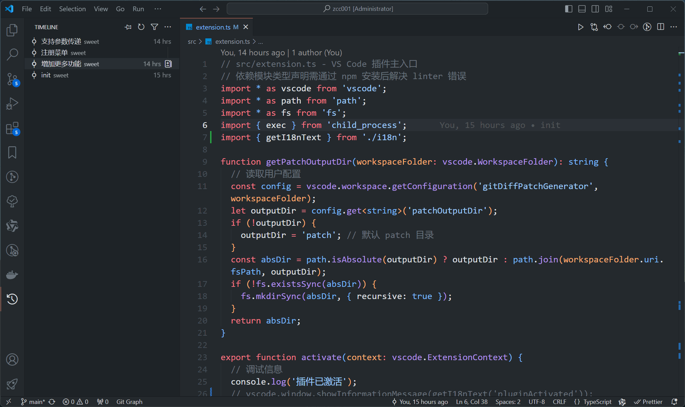
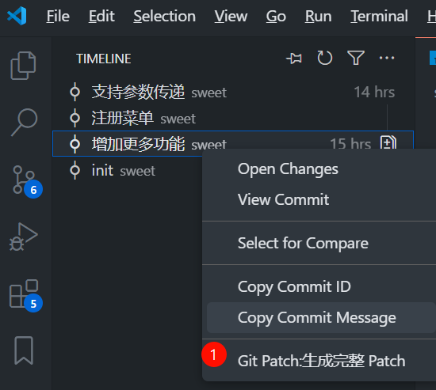

# Git Diff Patch Generator

## 功能简介

在 VS Code 的 Git 历史对比视图中，右键菜单可一键生成当前文件的 patch 文件，命名为 `文件名.hash1_hash2.patch`，并自动保存到当前工作区根目录。

## 使用方法

### 单文件模式

1. 在 VS Code 中打开一个 Git 仓库。

2. 对比某个文件的两个历史版本（右键文件 -> 选择"与上一个版本比较"或"与指定提交比较"）。

3. 在对比窗口右键，点击"Git Patch: 从对比视图生成 Patch"。

4. patch 文件会自动生成并在资源管理器中高亮显示。

   

### 完整模式

## 依赖

- 需要本地已安装 Git。
- 仅支持 VS Code 1.70 及以上版本。 
